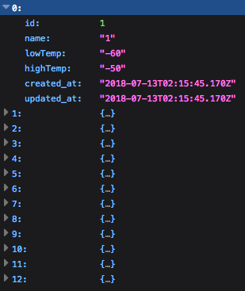
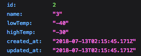
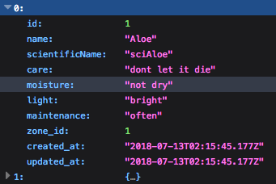
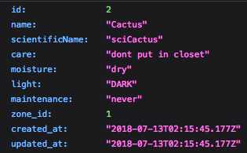

#  Leafage Backend 
## B.Y.O.B - Build Your Own Backend project
---
## Synopsis

We learned how to build a backend server but learned a lot more about ourselves along the way. This project is built using Node, Express, Knex, PSQL, and Nightmare. We focused on building a backend with data we scraped from [Fine Gardening's](https://www.finegardening.com/) amazing [Plant Guide](https://www.finegardening.com/plant-guide). Feel free to visit our front end and get a token to use our API [here]().

---
# Endpoints
## GET

### GET Zones
    GET /api/v1/zones
### Response
  

### GET a specific Zone
    GET /api/v1/zones/:id
### Response
  

---
### GET Plants
    GET /api/v1/plants
### Response
  
### GET a specific Plant
    GET /api/v1/plants/:id
### Response
  

---

## POST 

### POST to plants
    POST /api/v1/plants

---

## PUT

### PUT to a specific Plant
    PUT /api/v1/plants/:id

### PUT to a specific Zone
    PUT /api/v1/zones/:id

---

## Technologies

### Node - Express - Knex - PSQL - Nightmare

---

## Contributers 

[Jack Laird](https://github.com/JackLaird0) -
[Cameron Buscher](https://github.com/yayfiber)